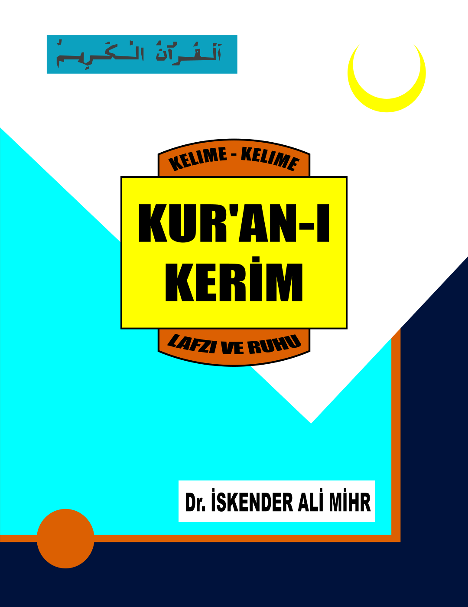

### Kur'ân-ı Kerim Lafzı ve Ruhu (Tefsir) İmam İskender Ali MİHR Hazretleri 
## [Kur'ân-ı Kerim Lafzı ve Ruhu (One Page)](https://orrstudio.github.io/KuraniKerim/index-onePage.html)
## [Kur'ân-ı Kerim Lafzı ve Ruhu (With Tree)](https://orrstudio.github.io/KuraniKerim/index-withTree.html)
## [Kur'ân-ı Kerim Lafzı ve Ruhu (MIHR.COM)](https://www.mihr.com/Kuran/Tefsir)
